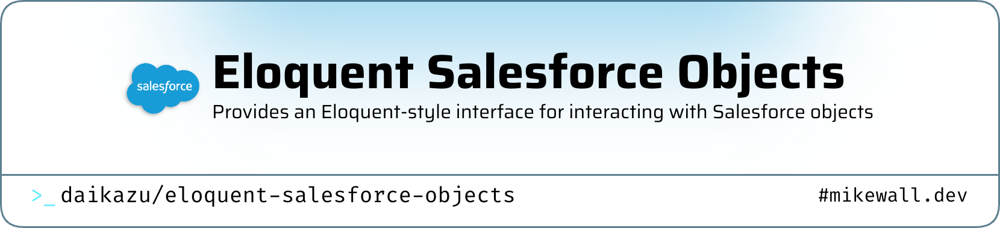

<picture>
   <source media="(prefers-color-scheme: dark)" srcset="art/header-dark.png">
   
</picture>

# Eloquent Salesforce Objects

[](https://packagist.org/packages/daikazu/eloquent-salesforce-objects)
[](https://github.com/daikazu/eloquent-salesforce-objects/actions?query=workflow%3Arun-tests+branch%3Amain)
[](https://github.com/daikazu/eloquent-salesforce-objects/actions?query=workflow%3A"Fix+PHP+code+style+issues"+branch%3Amain)
[](https://packagist.org/packages/daikazu/eloquent-salesforce-objects)

> **⚠️ WORK IN PROGRESS**
>
> This package is currently under active development and should be considered **alpha/beta quality**. While it is functional and tested, the API may change, and there may be undiscovered bugs.
>
> **Use at your own risk in production environments.** We recommend thorough testing in development/staging environments before deploying to production. Please report any issues you encounter!

Eloquent Salesforce Objects is a powerful Laravel package built on top of the excellent [omniphx/forrest](https://github.com/omniphx/forrest) package. It provides an Eloquent-style interface for working with Salesforce objects, allowing you to define Salesforce models just like Eloquent models and interact with your Salesforce data using familiar Laravel conventions.

## Features

- **Eloquent-Style Models** - Define Salesforce objects using familiar Laravel model syntax
- **CRUD Operations** - Create, read, update, and delete Salesforce records
- **Relationships** - Support for `hasMany`, `belongsTo`, and `hasOne` relationships
- **Aggregate Functions** - COUNT, SUM, AVG, MIN, MAX support
- **Pagination** - Built-in pagination with Laravel's paginator
- **Bulk Operations** - Efficient bulk insert, update, and delete operations
- **Automatic Authentication** - Seamless OAuth token management via [omniphx/forrest](https://github.com/omniphx/forrest)
- **Query Caching** - Intelligent caching with surgical record-level invalidation
- **Webhook Support** - Real-time cache invalidation via Salesforce Change Data Capture
- **Field Mapping** - Automatic conversion between Laravel and Salesforce naming conventions (optional)

## Requirements

- **PHP** 8.4 or higher
- **Laravel** 12.0 or higher
- **Salesforce** Account with API access enabled
- **[omniphx/forrest](https://github.com/omniphx/forrest)** - Salesforce REST API client (installed automatically as a dependency)

## Table of Contents

- [Quick Start](#quick-start)
- [Installation & Configuration](#installation--configuration)
- [Documentation](#documentation)
  - [Quickstart Guide](docs/quickstart.md)
  - [Models](docs/models.md)
  - [Querying Data](docs/querying.md)
  - [CRUD Operations](docs/crud.md)
  - [Relationships](docs/relationships.md)
  - [Working with Timestamps](docs/timestamps.md)
  - [Bulk Operations](docs/bulk-operations.md)
  - [Custom Apex REST Endpoints](docs/apex-rest.md)
  - [Query Caching](docs/caching.md)
  - [Webhook Integration](docs/webhooks.md)
  - [Aggregate Functions](docs/aggregates.md)
  - [Pagination](docs/pagination.md)
  - [Troubleshooting](docs/troubleshooting.md)
- [Testing](#testing)
- [Credits](#credits)
- [License](#license)

## Quick Start

### Installation

```bash
composer require daikazu/eloquent-salesforce-objects
```

### Configuration

Before using this package, you must configure the [omniphx/forrest](https://github.com/omniphx/forrest) package, which handles Salesforce authentication and API communication.

1. **Publish the Forrest configuration:**
   ```bash
   php artisan vendor:publish --provider="Omniphx\Forrest\Providers\Laravel\ForrestServiceProvider"
   ```

2. **Configure your Salesforce credentials** in `config/forrest.php` and `.env`

3. **See the [Forrest documentation](https://github.com/omniphx/forrest) for detailed setup instructions**

4. **Optionally publish this package's configuration:**
   ```bash
   php artisan vendor:publish --tag="eloquent-salesforce-objects-config"
   ```

For complete setup instructions, see our [Installation Guide](docs/installation.md).

### Basic Usage

Define a Salesforce model and query data using familiar Eloquent syntax:

```php
use Daikazu\EloquentSalesforceObjects\Models\SalesforceModel;

class Account extends SalesforceModel
{
    protected $table = 'Account';
    protected $fillable = ['Name', 'Industry', 'AnnualRevenue'];
}

// Query with familiar Eloquent syntax
$accounts = Account::where('Industry', 'Technology')
    ->orderBy('Name')
    ->get();

// Create, update, delete
$account = Account::create(['Name' => 'Acme Corp']);
$account->update(['Industry' => 'Manufacturing']);
$account->delete();

// Relationships
$account->contacts; // hasMany
$contact->account;  // belongsTo
```

Check out the [Quickstart Guide](docs/quickstart.md) for detailed examples and step-by-step instructions.

## Installation & Configuration

For detailed installation and configuration instructions, see:

- **[Installation Guide](docs/installation.md)** - Complete setup walkthrough
- **[Configuration Reference](docs/configuration.md)** - All configuration options
- **[omniphx/forrest Documentation](https://github.com/omniphx/forrest)** - Salesforce API client setup

## Documentation

### Getting Started

- **[Installation Guide](docs/installation.md)** - Detailed installation and setup instructions
- **[Configuration](docs/configuration.md)** - Configure Salesforce connection and package options
- **[Quickstart Guide](docs/quickstart.md)** - Get up and running in 5 minutes

### Core Concepts

- **[Models](docs/models.md)** - Creating and configuring Salesforce models
- **[Querying Data](docs/querying.md)** - Building SOQL queries with the query builder
- **[CRUD Operations](docs/crud.md)** - Creating, reading, updating, and deleting records
- **[Relationships](docs/relationships.md)** - Defining and using relationships between objects
- **[Working with Timestamps](docs/timestamps.md)** - Using Carbon for date manipulation with `diffForHumans()` and more

### Advanced Features

- **[Bulk Operations](docs/bulk-operations.md)** - Efficient bulk insert, update, and delete
- **[Custom Apex REST Endpoints](docs/apex-rest.md)** - Call custom Apex REST endpoints
- **[Query Caching](docs/caching.md)** - Intelligent caching with record-level invalidation
- **[Webhook Integration](docs/webhooks.md)** - Real-time cache invalidation with CDC
- **[Aggregate Functions](docs/aggregates.md)** - Using COUNT, SUM, AVG, MIN, MAX
- **[Pagination](docs/pagination.md)** - Paginating large result sets

### Reference

- **[Configuration Reference](docs/configuration.md)** - All configuration options explained
- **[Troubleshooting](docs/troubleshooting.md)** - Common issues and solutions

## Testing

Run the test suite:

```bash
composer test
```

## Changelog

Please see [CHANGELOG](CHANGELOG.md) for more information on what has changed recently.

## Contributing

Please see [CONTRIBUTING](CONTRIBUTING.md) for details.

## Security Vulnerabilities

Please review [our security policy](../../security/policy) on how to report security vulnerabilities.

## Credits

- [Mike Wall](https://github.com/daikazu)
- [All Contributors](../../contributors)

## License

The MIT License (MIT). Please see [License File](LICENSE.md) for more information.

---

**Need help?** Check out the [documentation](docs/) or [open an issue](https://github.com/daikazu/eloquent-salesforce-objects/issues).
