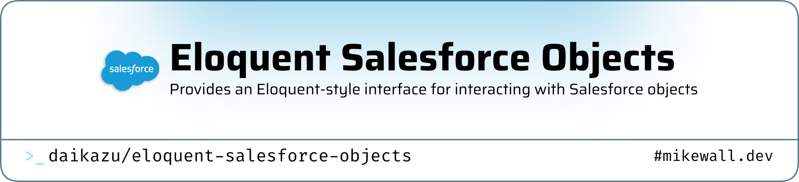

<picture>
   <source media="(prefers-color-scheme: dark)" srcset="art/header-dark.png">
   
</picture>

# Eloquent Salesforce Objects

[](https://packagist.org/packages/daikazu/eloquent-salesforce-objects)
[](https://github.com/daikazu/eloquent-salesforce-objects/actions?query=workflow%3Arun-tests+branch%3Amain)
[](https://github.com/daikazu/eloquent-salesforce-objects/actions?query=workflow%3A"Fix+PHP+code+style+issues"+branch%3Amain)
[](https://packagist.org/packages/daikazu/eloquent-salesforce-objects)

[](https://buymeacoffee.com/mikewallcodes)

A Laravel package that lets you work with Salesforce objects using Eloquent syntax. Built on top of [omniphx/forrest](https://github.com/omniphx/forrest) for authentication and API communication.

This package was heavily inspired by fabulous [roblesterjr04/EloquentSalesForce](https://github.com/roblesterjr04/EloquentSalesForce), but written from the ground up with modern PHP 8.4+, full type safety, and a cleaner architecture. If you're migrating from that package, see the [migration guide](docs/migration-from-eloquent-salesforce.md).

## Features

- **Eloquent-Style Models** - Define Salesforce objects using familiar Laravel model syntax
- **CRUD Operations** - Create, read, update, and delete Salesforce records
- **Relationships** - `hasMany`, `belongsTo`, and `hasOne`
- **Batch Queries** - Execute multiple SOQL queries in a single API call
- **Bulk Operations** - Efficient bulk insert, update, and delete
- **Aggregate Functions** - COUNT, SUM, AVG, MIN, MAX
- **Pagination** - Built-in pagination with Laravel's paginator
- **Apex REST** - Call custom Apex REST endpoints
- **Model Generator** - `php artisan make:salesforce-model` scaffolds models from live Salesforce metadata

## Requirements

- PHP 8.4+
- Laravel 12.0+
- Salesforce account with API access

## Quick Start

```bash
composer require daikazu/eloquent-salesforce-objects
```

Configure [omniphx/forrest](https://github.com/omniphx/forrest) with your Salesforce credentials, then scaffold a model:

```bash
php artisan make:salesforce-model Account
```

Or define one manually:

```php
use Daikazu\EloquentSalesforceObjects\Models\SalesforceModel;

class Account extends SalesforceModel
{
    protected ?array $defaultColumns = [
        'Name',
        'Industry',
        'AnnualRevenue',
    ];
}
```

Query with familiar Eloquent syntax:

```php
$accounts = Account::where('Industry', 'Technology')
    ->orderBy('Name')
    ->get();

$account = Account::create(['Name' => 'Acme Corp']);
$account->update(['Industry' => 'Manufacturing']);
$account->delete();

$account->contacts; // hasMany
$contact->account;  // belongsTo
```

See the [Quickstart Guide](docs/quickstart.md) for a full walkthrough.

## Documentation

### Getting Started

- [Installation](docs/installation.md)
- [Configuration](docs/configuration.md)
- [Quickstart Guide](docs/quickstart.md)

### Core Concepts

- [Model Generator](docs/model-generator.md) - Scaffold models from live metadata
- [Models](docs/models.md) - Defining and configuring models
- [Querying Data](docs/querying.md) - Building SOQL queries
- [CRUD Operations](docs/crud.md) - Create, read, update, delete
- [Relationships](docs/relationships.md) - hasMany, belongsTo, hasOne
- [Timestamps](docs/timestamps.md) - Carbon date handling

### Advanced

- [Batch Queries](docs/batch-queries.md) - Multiple queries in one API call
- [Bulk Operations](docs/bulk-operations.md) - Bulk insert, update, delete
- [Apex REST](docs/apex-rest.md) - Custom Apex REST endpoints
- [Aggregate Functions](docs/aggregates.md) - COUNT, SUM, AVG, MIN, MAX
- [Pagination](docs/pagination.md) - Paginating results

### Reference

- [Configuration Reference](docs/configuration.md)
- [Troubleshooting](docs/troubleshooting.md)
- [Migrating from EloquentSalesForce](docs/migration-from-eloquent-salesforce.md)

## AI Agent Skills (Laravel Boost)

The package ships two [Laravel Boost](https://laravel.com/docs/boost) skills that teach AI coding agents (Claude Code, Cursor, Codex, etc.) how to use it correctly:

| Skill | Use it for |
|-------|------------|
| `eloquent-salesforce-objects-development` | Defining models, querying, CRUD, bulk and batch operations, metadata, Apex REST, and testing against Salesforce |
| `migrating-from-eloquent-salesforce` | Moving an app from [roblesterjr04/EloquentSalesForce](https://github.com/roblesterjr04/EloquentSalesForce) to this package |

If your app uses Boost, the skills are offered automatically when you run:

```bash
php artisan boost:install
# or, if Boost is already installed
php artisan boost:update --discover
```

## Testing

```bash
composer test
```

## Credits

- [Mike Wall](https://github.com/daikazu)
- [All Contributors](../../contributors)

## License

MIT. See [LICENSE](LICENSE.md).

---

**Need help?** Check the [docs](docs/) or [open an issue](https://github.com/daikazu/eloquent-salesforce-objects/issues).
